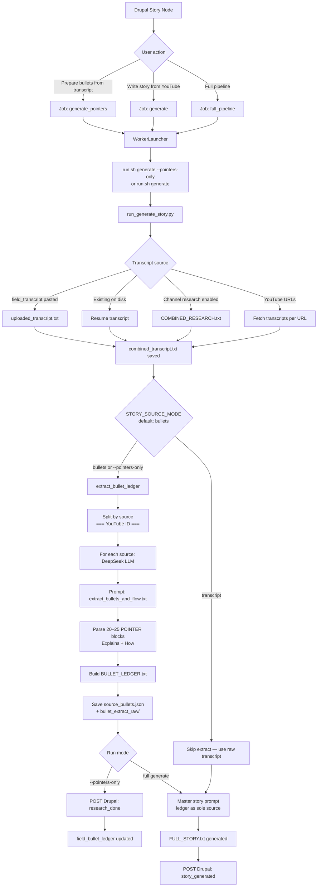
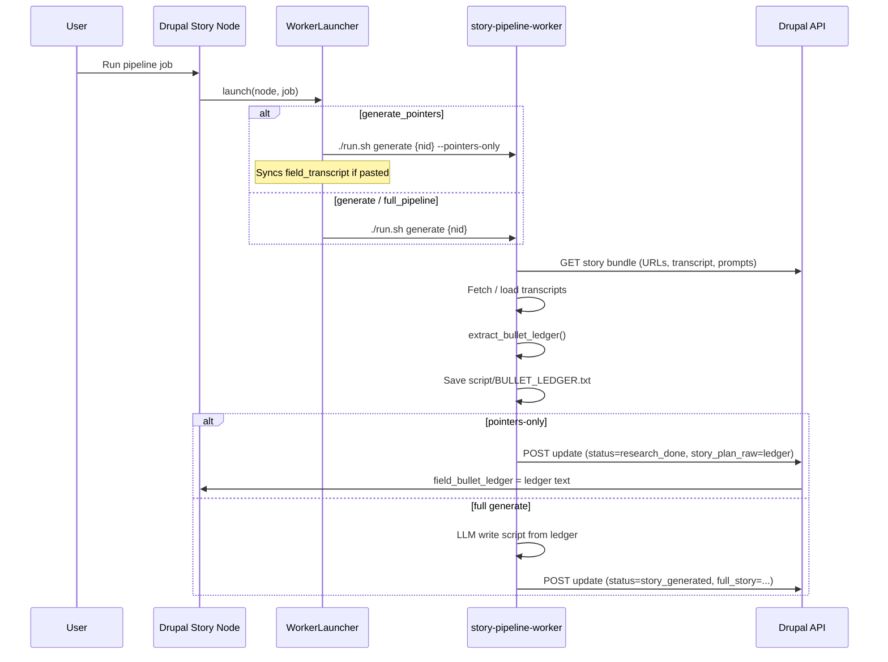
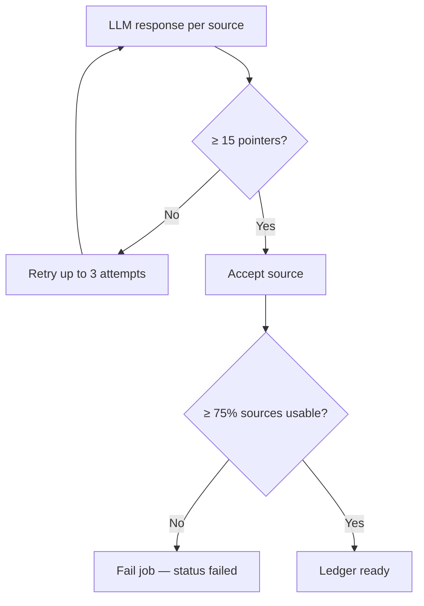

# Story Bullet Extraction — Flow Diagram

How the CMS creates bullet pointers from a story (transcript → LLM extract → ledger → optional full script).

---

## High-level flow



---

## CMS → Worker trigger



---

## Per-source bullet extraction (bullet_ledger.py)

```mermaid
flowchart LR
    subgraph Input
        T[Combined transcript]
    end

    subgraph Split
        S1[Source 1: YouTube abc123]
        S2[Source 2: YouTube def456]
        SN[Source N ...]
    end

    subgraph LLM["DeepSeek (per source)"]
        P[extract_bullets_and_flow.txt]
        R[Raw POINTER output]
    end

    subgraph Parse
        PT[parse_extraction_output]
        PTR[pointers: title, explains, how]
        BUL[flat bullets: title | Explains | How]
    end

    subgraph Output
        LED[BULLET_LEDGER.txt]
        JSON[source_bullets.json]
        RAW[bullet_extract_raw/*.txt]
    end

    T --> S1 & S2 & SN
    S1 --> P --> R --> PT --> PTR --> BUL
    PTR --> LED
    BUL --> JSON
    R --> RAW
```

---

## Pointer format (what the LLM returns)

Each source yields **20–25 pointers** in this structure:

```
Story Topic: [one line]

Total Pointers: [20–25]

### POINTER 01 — [SHORT TITLE]

**Explains:**
Why this beat matters in the story.

**How:**
What happened — names, dates, places, numbers from transcript.

### POINTER 02 — ...
```

Parsed into JSON (`source_bullets.json`):

```json
{
  "source_id": "XmGO4O2vpJw",
  "source_title": "YouTube XmGO4O2vpJw",
  "story_topic": "...",
  "pointers": [
    {
      "number": 1,
      "title": "INDIA WAS ENSLAVED BY A PRIVATE COMPANY",
      "explains": "...",
      "how": "..."
    }
  ],
  "pointer_count": 25,
  "bullets": ["title | Explains: ... | How: ..."],
  "story_flow": ["title1", "title2", "..."]
}
```

---

## Quality gates



---

## File locations

| Artifact | Path |
|----------|------|
| Combined transcript | `{asset_root}/{type}/{slug}/script/combined_transcript.txt` |
| Channel research transcript | `.../script/COMBINED_RESEARCH.txt` |
| Pasted transcript | `.../script/uploaded_transcript.txt` |
| **Bullet ledger** | `.../script/BULLET_LEDGER.txt` |
| Structured bullets | `.../script/source_bullets.json` |
| Raw LLM extracts | `.../script/bullet_extract_raw/{source_id}.txt` |
| Full script (after generate) | `.../script/FULL_STORY.txt` |

Example: `cms-generate-stories/general/162-the-east-india-company-.../script/`

---

## Drupal fields

| Field | When populated |
|-------|----------------|
| `field_transcript` | User pastes transcript (input) |
| `field_bullet_ledger` | After `generate_pointers` → `research_done` |
| `field_full_story` | After `generate` → `story_generated` |
| `field_status` | `research_done` (bullets only) or `story_generated` |

---

## Environment toggles

| Variable | Default | Effect |
|----------|---------|--------|
| `STORY_SOURCE_MODE` | `bullets` | Use ledger for script generation |
| `STORY_SOURCE_MODE=transcript` | — | Skip ledger; pass raw transcript to master prompt |
| `STORY_BULLET_PROMPT_PATH` | — | Override extract prompt file |
| `STORY_ASSET_ROOT` | from Drupal config | Where `cms-generate-stories/` files are written |

---

## Key source files

| Component | File |
|-----------|------|
| CMS job launcher | `web/modules/custom/story_pipeline/src/Service/WorkerLauncher.php` |
| CMS field sync | `web/modules/custom/story_pipeline/src/Service/StoryPipelineManager.php` |
| Orchestration | `story-pipeline-worker/run_generate_story.py` |
| Bullet extraction | `story-pipeline-worker/bullet_ledger.py` |
| Extract prompt | `story-pipeline-worker/prompts/extract_bullets_and_flow.txt` |

---

## One-line summary

**Transcripts → split by YouTube source → DeepSeek extracts 20–25 story pointers each → merged into BULLET_LEDGER.txt → (optional) full script written from ledger only, not raw transcripts.**
