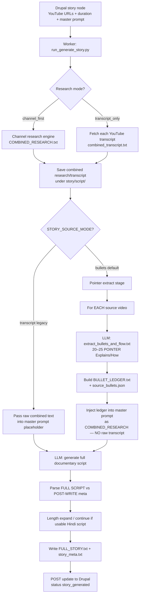
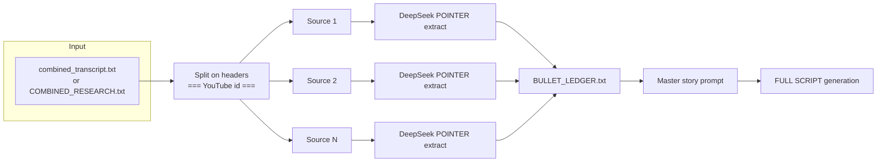
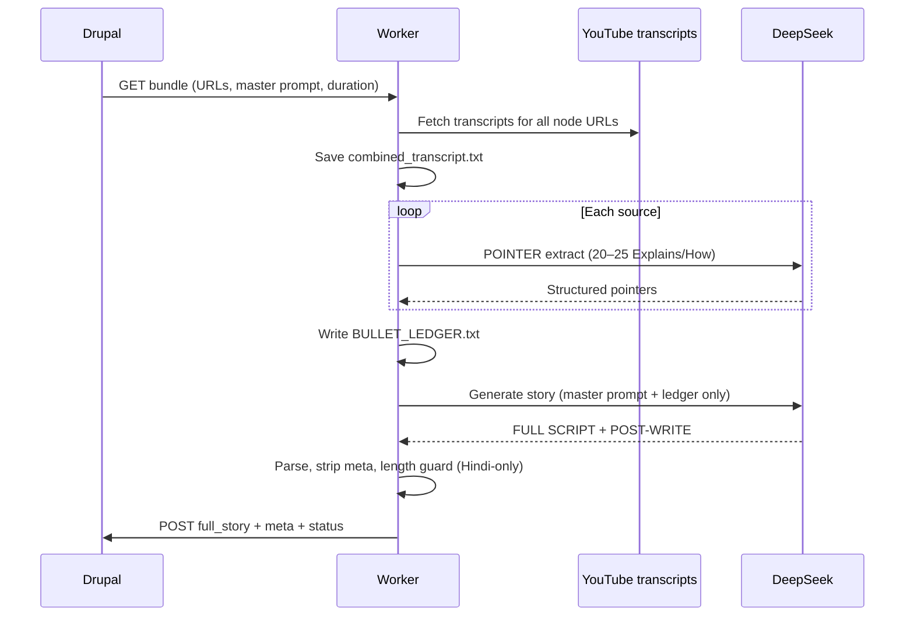

# Story generate — pointer ledger flow

How `./run.sh generate <story_id>` works when `STORY_SOURCE_MODE=bullets` (default).

## High-level



## Pointer extract (detail)

Prompt source: `prompts/extract_bullets_and_flow.txt`  
(optional override via `STORY_BULLET_PROMPT_PATH`, e.g. the edited `cms-generate-stories/bullet promt` file)



## Per-source extraction output shape

```text
**Story Topic:** …
**Total Pointers:** 20–25

### POINTER 01 — SHORT TITLE

**Explains:**
…

**How:**
…

### POINTER 02 — …
…
```

## Artifacts on disk

```text
cms-generate-stories/{type}/{id}-{slug}/
  script/
    combined_transcript.txt   # raw transcripts (debug only)
    BULLET_LEDGER.txt         # sole research fed to master prompt
    source_bullets.json       # structured pointers
    bullet_extract_raw/       # raw DeepSeek extracts per source
    FULL_STORY.txt            # final narration only
    story_meta.txt            # post-write / validator meta
  prompts/
    story-builder-input.txt   # full prompt sent to LLM (includes ledger, not raw)
```

## Modes

| Mode | How to run | What master prompt receives |
|------|------------|-----------------------------|
| **bullets** (default) | `./run.sh generate 126` | `BULLET_LEDGER.txt` only (POINTER format) |
| **transcript** (legacy) | `./run.sh generate 126 --source-mode transcript` | Full combined raw transcripts |

Env overrides:
- `STORY_SOURCE_MODE=bullets|transcript`
- `STORY_BULLET_PROMPT_PATH=/path/to/bullet promt` (optional)

## Sequence (happy path)



## Safety (why #126 broke before)

- Length expansion already refused stubs under 25% of target.
- Length-guard continuation now also refuses:
  - stubs under 25% of target
  - bodies that are not usable Hindi narration (English planning/meta)
- Jobs with a bad first pass should fail length guard instead of appending junk.
